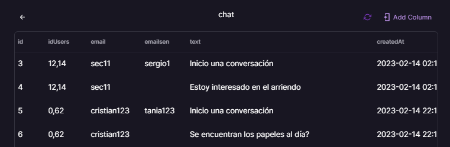
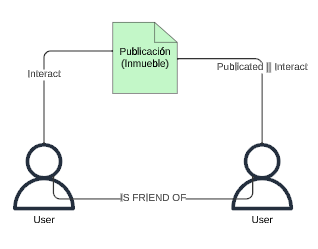

This is a [Next.js](https://nextjs.org/) project bootstrapped with [`create-next-app`](https://github.com/vercel/next.js/tree/canary/packages/create-next-app).

## Getting Started

First, run the development server:

```bash
npm run dev
# or
yarn dev
```

Open [http://localhost:3000](http://localhost:3000) with your browser to see the result.

You can start editing the page by modifying `pages/index.tsx`. The page auto-updates as you edit the file.

[API routes](https://nextjs.org/docs/api-routes/introduction) can be accessed on [http://localhost:3000/api/hello](http://localhost:3000/api/hello). This endpoint can be edited in `pages/api/hello.ts`.

The `pages/api` directory is mapped to `/api/*`. Files in this directory are treated as [API routes](https://nextjs.org/docs/api-routes/introduction) instead of React pages.

## Learn More

To learn more about Next.js, take a look at the following resources:

- [Next.js Documentation](https://nextjs.org/docs) - learn about Next.js features and API.
- [Learn Next.js](https://nextjs.org/learn) - an interactive Next.js tutorial.

You can check out [the Next.js GitHub repository](https://github.com/vercel/next.js/) - your feedback and contributions are welcome!

# Bienvenido a Waroom (Frontend)
	> La aplicación fue desarrollada para la presentación de mi tesis en la carrera de tecnologias de la información.
# Arquitectura
<div align="center">    </div>

Hi! I'm your first Markdown file in **StackEdit**. If you want to learn about StackEdit, you can read me. If you want to play with Markdown, you can edit me. Once you have finished with me, you can create new files by opening the **file explorer** on the left corner of the navigation bar.
# Tabla SQL (Sección de chat)
- Esta tabla permite que se almacenen los datos del chat
- Esta tabla se llama **chat** 
<div align="center">    </div>

# Base de datos basada en grafos
- La base de datos es neo4j
- Los usuarios podrán publicar sus inmuebles lo cuál se relacionará el usuario con el inmueble
- Además los usuarios podrán interactuar con los inmuebles ya sea de otros usuario o de ellos mismos
- Las actividades a realizar son : 
	- Dar like a publicaciones
	- Comentar publicaciones
	- Crear publicaciones
	- Denunciar publicaciones
	- Enviar solicitud de amistad a otro usuario
<div align="center">    </div>

<div align="center">    </div>


